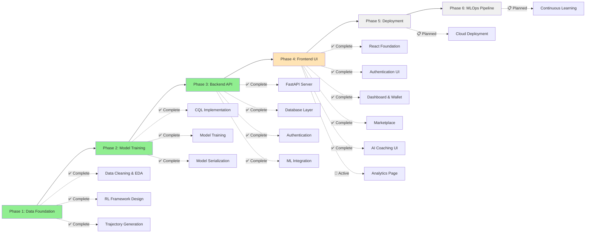

# FinCoach 🤖💰

**AI-Powered Financial Wellness Agent Using Offline Reinforcement Learning**

[](https://python.org)
[](https://reactjs.org)
[](https://typescriptlang.org)
[](https://fastapi.tiangolo.com)
[](https://postgresql.org)
[](https://pytorch.org)
[](LICENSE)
[](#project-status)

FinCoach is an innovative AI system that goes beyond simple expense tracking to become a proactive financial wellness companion. Using offline reinforcement learning and Conservative Q-Learning (CQL), it learns from historical transaction data to provide personalized financial guidance and behavioral nudges.

## 🎯 Key Features

### ✅ **Currently Implemented**

- **Advanced Data Processing**: Comprehensive cleaning and feature engineering of financial transaction data
- **Reinforcement Learning Framework**: Complete RL problem formulation with state, action, and reward definitions
- **Conservative Q-Learning Model**: Trained using CQL algorithm for safe offline learning
- **Weekly Financial Health Assessment**: Automated state vector generation from transaction patterns
- **Multi-Category Spending Analysis**: Detailed breakdown across spending categories
- **FastAPI Backend**: Complete RESTful API with authentication, financial services, and ML integration
- **Database Layer**: PostgreSQL with SQLAlchemy ORM for data persistence
- **Authentication System**: JWT-based auth with user registration and login
- **Financial Services**: Wallet management, transaction tracking, and spending analytics
- **Product Marketplace**: Virtual product catalog with purchase simulation
- **AI Coaching Integration**: ML model serving with recommendation endpoints
- **React Frontend**: Modern TypeScript frontend with Tailwind CSS
  - ✅ Authentication UI with JWT token management
  - ✅ Interactive Dashboard with wallet display and quick actions
  - ✅ Full Marketplace with shopping cart and purchase system
  - ✅ AI Coaching interface with recommendations and feedback
  - ✅ Transaction Management with filtering, search, and balance charts
- **Admin System**: Complete admin user management with predefined admin accounts
- **Database Seeding**: Comprehensive seeding system with sample products and categories
- **Continuous Learning Module - Phase 1**: ✅ **COMPLETED** (January 13, 2025)

### 🚧 **In Development**

- **Advanced Analytics**: Spending insights and financial trends visualization
- **Admin Panel**: System management and user administration interface

### 📋 **Planned Features**

- **Behavioral Nudges**: Proactive spending alerts and savings suggestions
- **Personalized Budgeting**: AI-driven budget recommendations
- **Financial Goal Tracking**: Long-term financial health monitoring
- **Multi-user Support**: Enhanced scalable architecture

## 🏗️ Technology Stack

| Category             | Technologies                             |
| -------------------- | ---------------------------------------- |
| **Frontend**         | React 19, TypeScript, Vite, Tailwind CSS |
| **State Management** | TanStack Query, React Context            |
| **Backend**          | FastAPI, Pydantic, uvicorn               |
| **Database**         | PostgreSQL, SQLAlchemy ORM               |
| **Authentication**   | JWT tokens, bcrypt password hashing      |
| **Data Science**     | pandas, numpy, matplotlib, seaborn       |
| **Machine Learning** | PyTorch, scikit-learn                    |
| **RL Algorithm**     | Conservative Q-Learning (CQL)            |
| **Deployment**       | Docker, Docker Compose                   |
| **Development**      | ESLint, Prettier, pytest                 |

## 🚀 Quick Start

### Prerequisites

```bash
# Required
Python 3.9+
Node.js 18+
PostgreSQL 14+

# Optional (but recommended)
Docker & Docker Compose
```

### Docker Setup (Recommended)

```bash
# Clone and start services
git clone https://github.com/yourusername/fincoach.git
cd fincoach
docker-compose up -d

# Set up database and seed data
docker-compose exec backend python setup_fincoach.py

# Start frontend
cd frontend
npm install
npm run dev

# Access the application
# Frontend: http://localhost:5173
# Backend API: http://localhost:8000
# API Documentation: http://localhost:8000/docs
```

### Default Admin Accounts

- **Email**: `admin@fincoach.com` | **Password**: `password123`
- **Email**: `admin@example.com` | **Password**: `password123`
- **Email**: `test@admin.com` | **Password**: `password123`

## 🧠 AI/ML Components

### AI Architecture

**State Space (17 dimensions)**:

- Account balance, weekly spending/income
- Transaction frequency and velocity
- Category-wise spending breakdown
- Derived financial health metrics

**Action Space (5 actions)**:

- 0: Continue current behavior
- 1: Send spending alert
- 2: Suggest budget adjustment
- 3: Nudge to save
- 4: Positive reinforcement

**Reward Function**: Behavioral change incentives based on financial improvements

## 📁 Project Structure

```
fincoach/
├── 📊 dataset/                           # Financial transaction datasets
├── 📓 notebooks/                         # Jupyter notebooks for ML development
├── 🤖 models/                           # Trained ML model artifacts
├── 🔧 backend/                          # FastAPI backend application
│   ├── app/                            # Main application code
│   │   ├── main.py                     # FastAPI app entry point
│   │   ├── database.py                 # Database configuration
│   │   ├── seed_data.py                # Database seeding script
│   │   ├── models/                     # SQLAlchemy & Pydantic models
│   │   ├── services/                   # Business logic services
│   │   ├── routers/                    # API route handlers
│   │   └── middleware/                 # Authentication middleware
│   ├── tests/                          # Backend test suite
├── 🎨 frontend/                         # React TypeScript application
│   ├── src/                           # Source code
│   │   ├── components/                # React components by feature
│   │   ├── contexts/                  # React contexts (Auth, Cart, Toast)
│   │   ├── hooks/                     # Custom hooks for API calls
│   │   ├── services/                  # API service layer
│   │   ├── types/                     # TypeScript type definitions
│   │   ├── pages/                     # Page components
│   │   └── lib/                       # Utility libraries
├── 🐳 docker-compose.yml               # Multi-service orchestration
├── 📋 ARCHITECTURE.md                   # Detailed architecture documentation
└── 📖 README.md                        # This file
```

## 📊 Project Status



**Current Status**: Phase 4 Active - Frontend UI Development

## 🔒 Security Features

- **JWT Authentication**: Secure token-based authentication
- **Password Hashing**: bcrypt with salt for password security
- **CORS Configuration**: Proper cross-origin request handling
- **Input Validation**: Pydantic models for request validation
- **SQL Injection Prevention**: SQLAlchemy ORM protection
- **Admin Access Control**: Email-based admin user identification
