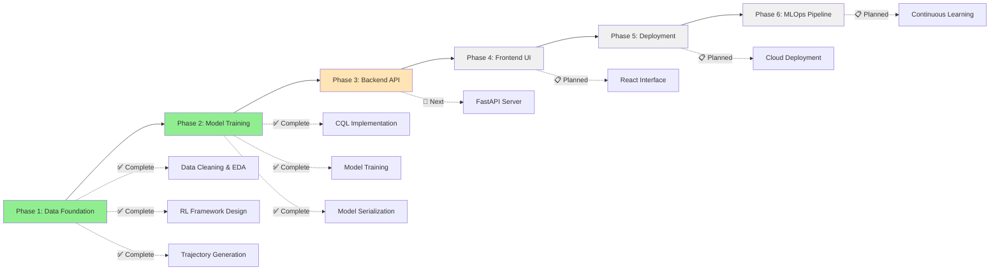

# FinCoach 🤖💰

**AI-Powered Financial Wellness Agent Using Offline Reinforcement Learning**

[](https://python.org)
[](https://pytorch.org)
[](LICENSE)
[](#project-status)

FinCoach is an innovative AI system that goes beyond simple expense tracking to become a proactive financial wellness companion. Using offline reinforcement learning and Conservative Q-Learning (CQL), it learns from historical transaction data to provide personalized financial guidance and behavioral nudges.

## 🎯 Key Features

### ✅ **Currently Implemented**

- **Advanced Data Processing**: Comprehensive cleaning and feature engineering of financial transaction data
- **Reinforcement Learning Framework**: Complete RL problem formulation with state, action, and reward definitions
- **Conservative Q-Learning Model**: Trained using CQL algorithm for safe offline learning
- **Weekly Financial Health Assessment**: Automated state vector generation from transaction patterns
- **Multi-Category Spending Analysis**: Detailed breakdown across spending categories

### 🚧 **In Development**

- **FastAPI Backend**: RESTful API for model serving and predictions
- **React Frontend**: Interactive web interface for user engagement
- **Real-time Recommendations**: Live financial coaching based on current spending patterns
- **MLOps Pipeline**: Continuous learning and model improvement system

### 🔮 **Planned Features**

- **Behavioral Nudges**: Proactive spending alerts and savings suggestions
- **Personalized Budgeting**: AI-driven budget recommendations
- **Financial Goal Tracking**: Long-term financial health monitoring
- **Multi-user Support**: Scalable architecture for multiple users

## 🏗️ Technology Stack

| Category             | Technologies                       |
| -------------------- | ---------------------------------- |
| **Data Science**     | pandas, numpy, matplotlib, seaborn |
| **Machine Learning** | PyTorch, scikit-learn              |
| **RL Algorithm**     | Conservative Q-Learning (CQL)      |
| **Backend**          | FastAPI, Pydantic, uvicorn         |
| **Frontend**         | React, axios, modern CSS           |
| **Deployment**       | Docker, AWS/Heroku, Netlify/Vercel |
| **MLOps**            | Automated retraining, A/B testing  |

## 📊 Project Status


```mermaid
graph LR
    A[Phase 1: Data Foundation] --> B[Phase 2: Model Training]
    B --> C[Phase 3: Backend API]
    C --> D[Phase 4: Frontend UI]
    D --> E[Phase 5: Deployment]
    E --> F[Phase 6: MLOps Pipeline]

    A -.->|✅ Complete| A1[Data Cleaning & EDA]
    A -.->|✅ Complete| A2[RL Framework Design]
    A -.->|✅ Complete| A3[Trajectory Generation]

    B -.->|✅ Complete| B1[CQL Implementation]
    B -.->|✅ Complete| B2[Model Training]
    B -.->|✅ Complete| B3[Model Serialization]

    C -.->|🚧 Next| C1[FastAPI Server]
    D -.->|📋 Planned| D1[React Interface]
    E -.->|📋 Planned| E1[Cloud Deployment]
    F -.->|📋 Planned| F1[Continuous Learning]

    style A fill:#90EE90
    style B fill:#90EE90
    style C fill:#FFE4B5
    style D fill:#F0F0F0
    style E fill:#F0F0F0
    style F fill:#F0F0F0
```

**Current Status**: Phase 2 Complete - Ready for Backend Development

## 🚀 Quick Start

### Prerequisites

```bash
Python 3.8+
pip or conda package manager
Jupyter Notebook environment
```

### Installation

1. **Clone the repository**

```bash
git clone https://github.com/yourusername/fincoach.git
cd fincoach
```

2. **Set up virtual environment**

```bash
python -m venv fincoach-env
source fincoach-env/bin/activate  # On Windows: fincoach-env\Scripts\activate
```

3. **Install dependencies**

```bash
pip install pandas numpy matplotlib seaborn torch jupyter
```

4. **Launch Jupyter Notebook**

```bash
jupyter notebook
```

### Running the Current Implementation

1. **Data Exploration & Preparation**

```bash
# Open and run notebooks/Data_Exploration_and_RL_Preparation.ipynb
# This will generate rl_trajectories.pkl for model training
```

2. **Model Training**

```bash
# Open and run notebooks/Model_Training.ipynb
# This will create cql_fincoach_model.pth
```

## 📁 Project Structure

```
fincoach/
├── dataset/                              # Financial transaction data
│   ├── anonymized_original_with_category.csv
│   ├── description_of_categories.csv
│   └── open_bank_transaction_data.csv
├── notebooks/                            # Jupyter notebooks for development
│   ├── Data_Exploration_and_RL_Preparation.ipynb
│   └── Model_Training.ipynb
├── models/                               # Trained model artifacts (generated)
│   └── cql_fincoach_model.pth
├── src/                                  # Source code (planned)
│   ├── api/                             # FastAPI backend
│   ├── frontend/                        # React application
│   └── ml/                              # ML utilities and training scripts
├── tests/                               # Test suite (planned)
├── docker/                              # Docker configurations (planned)
├── requirements.txt                     # Python dependencies
└── README.md                           # This file
```

## 🧠 AI Architecture

### Reinforcement Learning Framework

**State Space (S)**: Weekly financial health snapshot

- Account balance
- Total spending and income
- Spending by category (groceries, dining, entertainment, etc.)
- Transaction frequency
- Derived metrics (savings rate, spending velocity)

**Action Space (A)**: Discrete coaching actions

- `0`: Do Nothing
- `1`: Send Spending Alert
- `2`: Suggest Budget Adjustment
- `3`: Nudge to Save
- `4`: Positive Reinforcement

**Reward Function (R)**: Behavioral change incentives

- `+10`: Successful savings increase after nudge
- `+5`: Spending reduction after alert
- `-2`: Overall balance decrease
- Custom rewards for category-specific improvements

### Model Architecture

```python
class QNetwork(nn.Module):
    def __init__(self, state_dim, action_dim):
        super(QNetwork, self).__init__()
        self.network = nn.Sequential(
            nn.Linear(state_dim, 128),
            nn.ReLU(),
            nn.Linear(128, 128),
            nn.ReLU(),
            nn.Linear(128, action_dim)
        )
```

**Conservative Q-Learning (CQL)**: Prevents overestimation of unseen state-action pairs, ensuring safe recommendations based on historical data patterns.

## 📈 Development Roadmap

### Phase 1: Data Foundation & Exploration ✅

- [x] Data cleaning and preprocessing
- [x] Exploratory data analysis with visualizations
- [x] RL problem formulation
- [x] Trajectory generation from historical data

### Phase 2: Offline Model Training ✅

- [x] Conservative Q-Learning implementation
- [x] Neural network architecture design
- [x] Model training and validation
- [x] Model serialization and artifacts

### Phase 3: Backend API Development 🚧

- [ ] FastAPI server setup
- [ ] Model loading and inference endpoints
- [ ] Request/response validation with Pydantic
- [ ] Comprehensive logging system
- [ ] Docker containerization

### Phase 4: Frontend Interface Development 📋

- [ ] React application initialization
- [ ] User input forms and state visualization
- [ ] API integration and error handling
- [ ] Responsive design and UX optimization

### Phase 5: MLOps & Continuous Learning 📋

- [ ] Live data collection pipeline
- [ ] Automated model retraining
- [ ] A/B testing framework
- [ ] Performance monitoring and alerting

## 🔬 Research Foundation

This project is built upon the **MoneyVis dataset**:

> Elif E Firat, Dharmateja Vytia, Navya Vasudeva, Zhuoqun Jiang, Robert S Laramee,  
> "MoneyVis: Open Bank Transaction Data for Visualization and Beyond",  
> Eurovis Short Papers, Eurovis 2023, 12-16 June 2023, Leipzig, Germany,  
> https://doi.org/10.2312/evs.20231052

### Key Innovations

- **Offline Reinforcement Learning**: Learning optimal financial coaching policies from historical data without live user interaction
- **Conservative Q-Learning**: Ensuring safe recommendations by penalizing overconfident predictions on unseen scenarios
- **Behavioral Economics Integration**: Reward functions designed around proven financial behavior change principles
- **Scalable Architecture**: Designed for real-world deployment with continuous learning capabilities

### Development Guidelines

- Follow PEP 8 for Python code style
- Add docstrings to all functions and classes
- Include unit tests for new functionality
- Update documentation for API changes

## 📊 Performance Metrics

### Current Model Performance

- **Training Loss**: Converged after 1000 epochs
- **State Dimension**: Dynamic based on spending categories
- **Action Space**: 5 discrete actions
- **Model Size**: ~50KB (lightweight for deployment)

### Planned Metrics

- **User Engagement**: Session duration, feature usage
- **Financial Impact**: Savings increase, spending optimization
- **Model Accuracy**: Prediction confidence, reward correlation
- **System Performance**: API latency, uptime, scalability

## 🔒 Privacy & Security

- **Data Anonymization**: All transaction data is pre-anonymized
- **Local Processing**: Sensitive computations performed locally
- **Secure API**: Authentication and rate limiting planned
- **GDPR Compliance**: Privacy-by-design architecture

## 📄 License

This project is licensed under the MIT License - see the [LICENSE](LICENSE) file for details.

## 🙏 Acknowledgments

- **MoneyVis Team** for providing the foundational dataset
- **Conservative Q-Learning** researchers for the offline RL methodology
- **Open Source Community** for the excellent tools and libraries

**FinCoach** - Transforming financial wellness through intelligent AI coaching 🚀

_Built with ❤️ using Python, PyTorch, and cutting-edge reinforcement learning_
