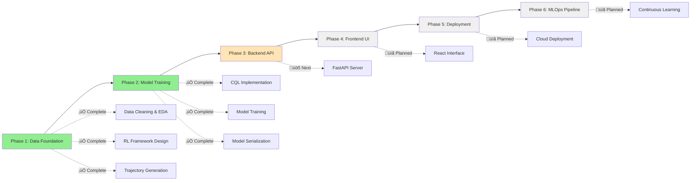

# FinCoach 🤖💰

**AI-Powered Financial Wellness Agent Using Offline Reinforcement Learning**

[](https://python.org)
[](https://pytorch.org)
[](LICENSE)
[](#project-status)

FinCoach is an innovative AI system that goes beyond simple expense tracking to become a proactive financial wellness companion. Using offline reinforcement learning and Conservative Q-Learning (CQL), it learns from historical transaction data to provide personalized financial guidance and behavioral nudges.

## 🎯 Key Features

### ✅ **Currently Implemented**

- **Advanced Data Processing**: Comprehensive cleaning and feature engineering of financial transaction data
- **Reinforcement Learning Framework**: Complete RL problem formulation with state, action, and reward definitions
- **Conservative Q-Learning Model**: Trained using CQL algorithm for safe offline learning
- **Weekly Financial Health Assessment**: Automated state vector generation from transaction patterns
- **Multi-Category Spending Analysis**: Detailed breakdown across spending categories
- **FastAPI Backend**: Complete RESTful API with authentication, financial services, and ML integration
- **Database Layer**: PostgreSQL with SQLAlchemy ORM for data persistence
- **Authentication System**: JWT-based auth with user registration and login
- **Financial Services**: Wallet management, transaction tracking, and spending analytics
- **Product Marketplace**: Virtual product catalog with purchase simulation
- **AI Coaching Integration**: ML model serving with recommendation endpoints
- **React Frontend Foundation**: Modern TypeScript frontend with Tailwind CSS
  - ✅ Task 1: Project Setup & Foundation (Complete)
  - ✅ Task 2: API Client & TanStack Query Setup (Complete)
  - ✅ Task 3: TypeScript Types & Interfaces (Complete)
  - ✅ Task 4: Authentication Service & Context (Complete)
  - ✅ Task 5: Basic Routing & Layout Structure (Complete)
  - ✅ Task 6: Login & Register Forms (Complete)
  - ✅ Task 7: Financial Services & Hooks (Complete)
  - ✅ Task 8: Dashboard with Wallet Display (Complete)
  - ✅ Task 9: Product Services & Marketplace Foundation (Complete)
  - ✅ Task 10: Marketplace UI Components (Complete)
  - ✅ Task 11: AI Coaching Services & Components (Complete)
- **Frontend Authentication**: JWT token management, auth context, and TanStack Query hooks
- **Frontend Routing**: React Router with protected routes, navigation, and layout components
- **Authentication UI**: Complete login/register forms with validation and backend integration
- **Financial Data Layer**: Complete financial services with smart caching, optimistic updates, and error handling
- **Toast Notification System**: Comprehensive user feedback system with proper context management
- **Dashboard Interface**: Functional dashboard with wallet balance, recent transactions, and quick actions
- **Interactive Marketplace**: Full shopping cart system with persistent storage, product cards, cart sidebar, purchase modals, and wallet integration
- **AI Coaching Interface**: Complete coaching dashboard with recommendation cards, financial health scoring, feedback system, and dashboard integration

### 🚧 **In Development**

- **Advanced Features**: Transaction management, analytics, admin panel (Task 12-15)
- **Backend Enhancements**: Recommendation history storage, enhanced feedback persistence (see `AI_COACHING_REMAINING_TASKS.md`)

### � **Planned Features**

- **Behavioral Nudges**: Proactive spending alerts and savings suggestions
- **Personalized Budgeting**: AI-driven budget recommendations
- **Financial Goal Tracking**: Long-term financial health monitoring
- **Multi-user Support**: Scalable architecture for multiple users

## 🏗️ Technology Stack

| Category             | Technologies                       |
| -------------------- | ---------------------------------- |
| **Data Science**     | pandas, numpy, matplotlib, seaborn |
| **Machine Learning** | PyTorch, scikit-learn              |
| **RL Algorithm**     | Conservative Q-Learning (CQL)      |
| **Backend**          | FastAPI, Pydantic, uvicorn         |
| **Frontend**         | React, axios, modern CSS           |
| **Deployment**       | Docker, AWS/Heroku, Netlify/Vercel |
| **MLOps**            | Automated retraining, A/B testing  |

## 📊 Project Status



**Current Status**: Phase 2 Complete - Ready for Backend Development

## 🚀 Quick Start

### Prerequisites

```bash
Python 3.8+
Node.js 18+
Docker & Docker Compose (optional)
```

### Installation

1. **Clone the repository**

```bash
git clone https://github.com/yourusername/fincoach.git
cd fincoach
```

2. **Backend Setup**

```bash
cd backend
python -m venv venv
source venv/bin/activate  # On Windows: venv\Scripts\activate
pip install -r requirements.txt
```

3. **Frontend Setup**

```bash
cd ../frontend
npm install
```

### Running the Application

#### Option 1: Using Docker Compose (Recommended)

```bash
# From project root
docker-compose up
```

- Backend API: http://localhost:8000
- Frontend App: http://localhost:5173
- API Documentation: http://localhost:8000/docs

#### Option 2: Manual Setup

1. **Start the Backend**

```bash
cd backend
source venv/bin/activate
uvicorn app.main:app --reload --host 0.0.0.0 --port 8000
```

2. **Start the Frontend**

```bash
cd frontend
npm run dev
```

### Running the ML Components

1. **Data Exploration & Preparation**

```bash
# Open and run notebooks/Data_Exploration_and_RL_Preparation.ipynb
# This will generate rl_trajectories.pkl for model training
```

2. **Model Training**

```bash
# Open and run notebooks/Model_Training.ipynb
# This will create cql_fincoach_model.pth
```

### Testing the Implementation

1. **Backend API Testing**

   - Visit http://localhost:8000/docs for interactive API documentation
   - Test authentication endpoints with sample user data
   - Explore financial and product management APIs

2. **Frontend Authentication Testing**

   - Visit http://localhost:5173 (or 5174 if 5173 is busy)
   - Test user registration and login functionality
   - Verify JWT token management and auth state persistence

3. **Full Stack Integration**
   - Register a new user through the frontend
   - Login and verify authentication state
   - Test API communication between frontend and backend

## 📁 Project Structure

```
fincoach/
├── dataset/                              # Financial transaction data
│   ├── anonymized_original_with_category.csv
│   ├── description_of_categories.csv
│   └── open_bank_transaction_data.csv
├── notebooks/                            # Jupyter notebooks for development
│   ├── Data_Exploration_and_RL_Preparation.ipynb
│   └── Model_Training.ipynb
├── models/                               # Trained model artifacts (generated)
│   └── cql_fincoach_model.pth
├── backend/                              # FastAPI backend application
│   ├── app/                             # Main application code
│   │   ├── main.py                      # FastAPI app entry point
│   │   ├── database.py                  # Database configuration
│   │   ├── models/                      # SQLAlchemy models
│   │   ├── services/                    # Business logic services
│   │   ├── routers/                     # API route handlers
│   │   └── middleware/                  # Custom middleware
│   ├── tests/                           # Backend test suite
│   ├── requirements.txt                 # Python dependencies
│   ├── Dockerfile                       # Docker configuration
│   └── start.sh                         # Startup script
├── frontend/                             # React TypeScript application
│   ├── src/                             # Source code
│   │   ├── components/                  # React components
│   │   ├── contexts/                    # React contexts
│   │   ├── hooks/                       # Custom hooks
│   │   ├── services/                    # API services
│   │   ├── types/                       # TypeScript types
│   │   ├── lib/                         # Utility libraries
│   │   └── App.tsx                      # Main app component
│   ├── package.json                     # Node.js dependencies
│   ├── tailwind.config.js               # Tailwind CSS config
│   └── vite.config.ts                   # Vite configuration
├── docker-compose.yml                    # Multi-service orchestration
├── FRONTEND_IMPLEMENTATION_TASKS.md      # Frontend development plan
├── FINCOACH_IMPLEMENTATION_EPIC.md       # Overall project epic
└── README.md                            # This file
```

## 🧠 AI Architecture

### Reinforcement Learning Framework

**State Space (S)**: Weekly financial health snapshot

- Account balance
- Total spending and income
- Spending by category (groceries, dining, entertainment, etc.)
- Transaction frequency
- Derived metrics (savings rate, spending velocity)

**Action Space (A)**: Discrete coaching actions

- `0`: Do Nothing
- `1`: Send Spending Alert
- `2`: Suggest Budget Adjustment
- `3`: Nudge to Save
- `4`: Positive Reinforcement

**Reward Function (R)**: Behavioral change incentives

- `+10`: Successful savings increase after nudge
- `+5`: Spending reduction after alert
- `-2`: Overall balance decrease
- Custom rewards for category-specific improvements

### Model Architecture

```python
class QNetwork(nn.Module):
    def __init__(self, state_dim, action_dim):
        super(QNetwork, self).__init__()
        self.network = nn.Sequential(
            nn.Linear(state_dim, 128),
            nn.ReLU(),
            nn.Linear(128, 128),
            nn.ReLU(),
            nn.Linear(128, action_dim)
        )
```

**Conservative Q-Learning (CQL)**: Prevents overestimation of unseen state-action pairs, ensuring safe recommendations based on historical data patterns.

## 📈 Development Roadmap

### Phase 1: Data Foundation & Exploration ✅

- [x] Data cleaning and preprocessing
- [x] Exploratory data analysis with visualizations
- [x] RL problem formulation
- [x] Trajectory generation from historical data

### Phase 2: Offline Model Training ✅

- [x] Conservative Q-Learning implementation
- [x] Neural network architecture design
- [x] Model training and validation
- [x] Model serialization and artifacts

### Phase 3: Backend API Development 🚧

- [ ] FastAPI server setup
- [ ] Model loading and inference endpoints
- [ ] Request/response validation with Pydantic
- [ ] Comprehensive logging system
- [ ] Docker containerization

### Phase 4: Frontend Interface Development 📋

- [ ] React application initialization
- [ ] User input forms and state visualization
- [ ] API integration and error handling
- [ ] Responsive design and UX optimization

### Phase 5: MLOps & Continuous Learning 📋

- [ ] Live data collection pipeline
- [ ] Automated model retraining
- [ ] A/B testing framework
- [ ] Performance monitoring and alerting

## 🔬 Research Foundation

This project is built upon the **MoneyVis dataset**:

> Elif E Firat, Dharmateja Vytia, Navya Vasudeva, Zhuoqun Jiang, Robert S Laramee,  
> "MoneyVis: Open Bank Transaction Data for Visualization and Beyond",  
> Eurovis Short Papers, Eurovis 2023, 12-16 June 2023, Leipzig, Germany,  
> https://doi.org/10.2312/evs.20231052

### Key Innovations

- **Offline Reinforcement Learning**: Learning optimal financial coaching policies from historical data without live user interaction
- **Conservative Q-Learning**: Ensuring safe recommendations by penalizing overconfident predictions on unseen scenarios
- **Behavioral Economics Integration**: Reward functions designed around proven financial behavior change principles
- **Scalable Architecture**: Designed for real-world deployment with continuous learning capabilities

## 🤝 Contributing

We welcome contributions! Here's how to get started:

1. **Fork the repository**
2. **Create a feature branch**: `git checkout -b feature/amazing-feature`
3. **Make your changes** and add tests
4. **Commit your changes**: `git commit -m 'Add amazing feature'`
5. **Push to the branch**: `git push origin feature/amazing-feature`
6. **Open a Pull Request**

### Development Guidelines

- Follow PEP 8 for Python code style
- Add docstrings to all functions and classes
- Include unit tests for new functionality
- Update documentation for API changes

## 📊 Performance Metrics

### Current Model Performance

- **Training Loss**: Converged after 1000 epochs
- **State Dimension**: Dynamic based on spending categories
- **Action Space**: 5 discrete actions
- **Model Size**: ~50KB (lightweight for deployment)

### Planned Metrics

- **User Engagement**: Session duration, feature usage
- **Financial Impact**: Savings increase, spending optimization
- **Model Accuracy**: Prediction confidence, reward correlation
- **System Performance**: API latency, uptime, scalability

## 🔒 Privacy & Security

- **Data Anonymization**: All transaction data is pre-anonymized
- **Local Processing**: Sensitive computations performed locally
- **Secure API**: Authentication and rate limiting planned
- **GDPR Compliance**: Privacy-by-design architecture

## 📄 License

This project is licensed under the MIT License - see the [LICENSE](LICENSE) file for details.

## 🙏 Acknowledgments

- **MoneyVis Team** for providing the foundational dataset
- **Conservative Q-Learning** researchers for the offline RL methodology
- **Open Source Community** for the excellent tools and libraries

**FinCoach** - Transforming financial wellness through intelligent AI coaching 🚀

_Built with ❤️ using Python, PyTorch, and cutting-edge reinforcement learning_
